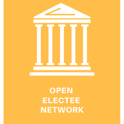

The Open Electree Network makes connections between electees and geo locations, like state, county, city, zip code, and address.

### 🚧 API

(in construction)

----

### 📊 Datasets
**1. Congressional and State legistor district** [link](https://github.com/mainstreetai/Open-Electee-Network/tree/main/data)

This dataset contains U.S. Congress and State legislature memeber information, including geomapping data and how they overlap with each other. 

(more to come)

----

### 🗣️ Applications of this network
**1. Know your representatives**

To get your voice heard, you need to know who represent you and whom you can elect.

**2. Know your pressure channels**

You can build coalition of state legislators within targeted House Members' Congressional Districts. 

----

### ❤️ Acknowledgement
- open states: https://openstates.org/data/
- aclu elections api: https://github.com/aclu-national/elections-api
