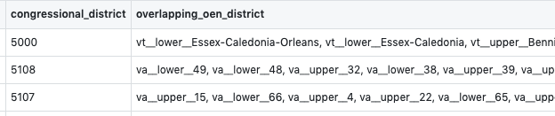

**Congressional and State legistor district**

*congress_data_lite.csv*
- Unique ID is `congressional_district`

*state_legsislature_data_lite.csv*
- Unique ID is `oen_district`

*overlapping.csv*
- A mapping from `congressional_district` to	`overlapping_oen_district`

----

(more to come)
